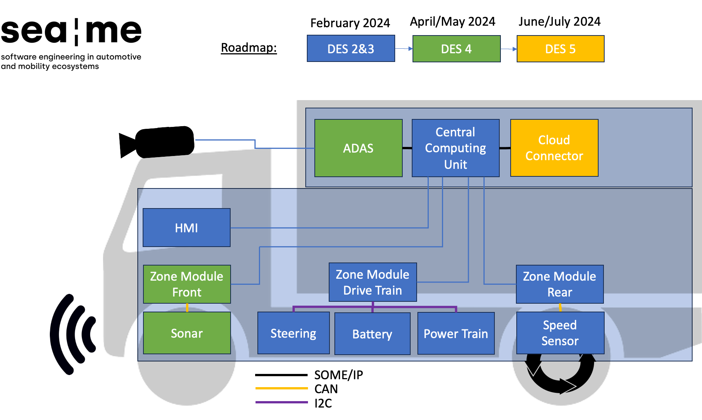

**!! UNDER CONSTRUCTION !!**

# DES04 - Parking Distance Control (PDC) and Advanced Driver Assistance Systems (ADAS)  

## Table of contents
  - [Introduction](#introduction)
  - [Collaborators](#collaborators)
  - [Demonstration Video](#demonstration-video)
  - [Project Structure](#project-structure)
  - [Architecture](#architecture)
  - [Documentation](#documentation)

## Introduction
This project is a merged from [embedded software (DES04)](https://github.com/SEA-ME/DES_PDC-System) and [autonomous lane detection (ADS01)](https://github.com/SEA-ME/ADS_Autonomous-Lane-Detection) of SEA-ME's cirriculum.  

The goal of this project is to enhance integrating a Park Distance Control (PDC) system and Lane Keeping Assist System (LKA) to the piracer.  
The PDC system will utilize ultrasonic sensors to detect the distance between the vehicle and any obstacles, and provide an audible response to the driver. In addition, the full stack feature development will be integrated into the existing Yocto image, creating a comprehensive and fully functional system.  
Furthermore, in this project, the intersection of virtual simulations and real-world applications is used to enable  mechanisms of the Lane Keeping Assist System (LKA), a pivotal Level 1 autonomous driving feature. Using advanced simulation platforms and hardware implement an LKAS that can operate both virtually and in the real world. 

The following sections will provide further details on the technical requirements, system architecture, software design, implementation, results, and references for this project.

## Collaborators
If you find any kinds of bugs or issues, please contact 
[Kian](https://github.com/kianwasabi), 
[Jinghong](https://github.com/Lagavulin9), 
[Seungwoo](https://github.com/SeungWoo-L), 
[Nikas](https://github.com/NikDoh)👌🏽

## Demonstration Video
The following videos demonstrate the features of the project.  

Demo Feature 1:  
  

## E/E Architecture
We are using a centralized E/E architecture.  
It is devided into the top computing zone and the lower sensor zone.  
In the computing zone, you will find the central computing unit and the ADAS Unit.  
The sensor zone is devided into the front, central and rear zone.  
The front zone contains the ultrasonic sensors for the PDC.  
The rear zone contains the speedsensor.  
  

## Software- and Harware Architecture
The following image gives a brief overview about the [software structure](/documentation/software_structure.md) that runs on the cars' [system structure](/documentation/system_structure.md).  
Each application serves a different functional based purpose and uses different peripheral interfaces and devices.   
BMWs' [CommonAPI](/documentation/common_api.md) ensure the communication between the applications via Scalable Service-Oriented Middleware over IP (SOME/IP). It is easy to add more apps to the system by using the [CI/CD workflows for CommonAPI](/documentation/workflows.md) we build.  
In the current setup, the [speed sensor](/documentation/rpm_speedsensor.md) is the only sensor that feeds the cars' [CAN bus](/documentation/can_bus.md) but it can seamlessly be extended by adding more sensors to the CAN bus.  
The system operates with a custom-made [Yocto Image](/DES_3_Head-Unit/documentation/yocto.md) deployed on the Raspberry Pi ECUs. 

## Project Structure

The following image shows the project structure for the DES3 Head-Unit project.  
- `apps`: submodules which hold the source code from the computing zone.   
- `sensors`: submodules for the front and rear zone controllers.  
- `image`: submodule that provides config files and recipes to bitbake the vehicles' ECU yocto image.
- `documentation`: summarizes all the projects' documentation.  

> _The development in each submodule is done individually by the assigned developer.  
Once a feature is ready, a new release following the teams' [conventions](/documentation/project_conventions.md) is published._  

## Delivery
To roll out the software, the sensors' controller and the ECU needs to be flashed.   

## Documentation

1) Requirements Gathering: 
  - [🧑🏽‍🏫 subject DES04](/documentation/subject_DES04.md) 
  - [🧑🏽‍🏫 subject ADS01](/documentation/subject_ADS01.md) 
  - [📝 project requirments](/documentation/project_requirments.md)
2) Planning Design, System & Software:
  - [🧑🏽‍🎨 frontend design](/documentation/design.md)
  - [🏎 system structure](/documentation/system_structure.md)
  - [👨🏽‍💻 software structure](/documentation/software_structure.md)
3) Team Collaboration:
  - [🔓 conventions](/documentation/project_conventions.md)
  - [📋 kanban board](https://github.com/orgs/DES-Team-02/projects/1)
4) Integration:  
    - Technologies: tbd  
    - Applications: see submdoules's README.md  
    - Sensors: see submdoules's README.md  
5) Testing: 
  - [📝 test requirments](/documentation/project-requirments.md)

